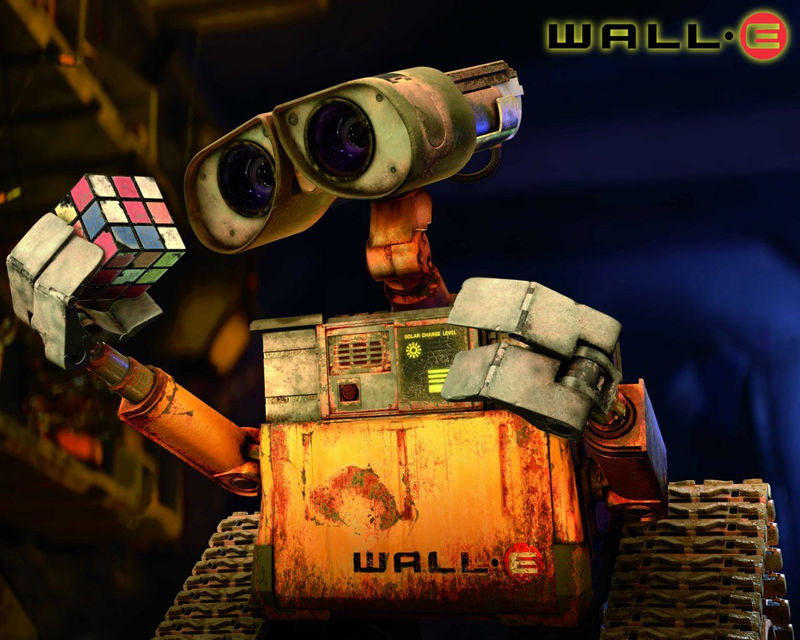

title: Yang Fan
date: 2015-10-30 11:18:12
---

Wall-E is my favorite cartoon character. I use it for almost all avatar where I don't want to show my own face. :P

## PROFILE
Talented software development engineer with Master degree and 6 years industry experience using cutting-edge technologies. Problem solver, able to identify opportunities for improvements and resolution. Productive in both team-based and self-managed projects. Patent pending.

## TECHNOLOGIES AND TOOLS
* AngularJS, jQuery, Node.js, Polymer
* Spring MVC, Hibernate, AspectJ, Scala
* Amazon Web Service (Simple Queue Service, Simple Notification Service, Dynamo DB, ElastiCache, Simple Storage Service, EC2)
* WPF/Silverlight, WCF, ASP.NET, ASP.NET MVC, LINQ, MS SQL Server, ADO.NET Entity Framework, Ninject
* Microsoft Visual Studio, Eclipse, JUnit
* SVN, Git

## SKILLS
* Solid data structures and algorithms
* Service Oriented Architecture
* Large scale and low latency system design
* Machine learning fundamentals
* Software development in Java, C#, C++, JavaScript, Ruby, * Python and VBA Frontend development in HTML5, CSS3 and Ajax
* Mobile application development on IOS, Android and Windows Phone
* Agile development (SCRUM) experience
* Cross group collaboration
